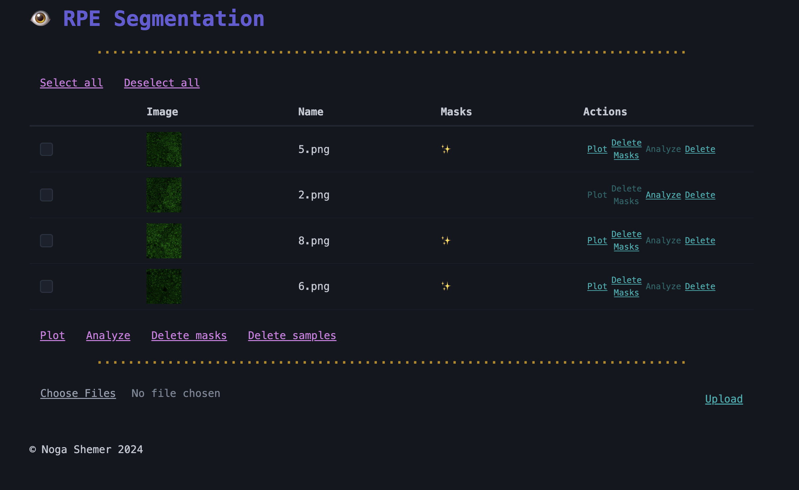
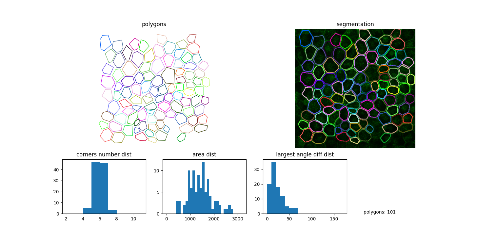

# 👁️ RPE Segmentation and Analysis
This project segments and analyzes Retinal Pigment Epithelium (RPE) cells in microscope images, providing tools to upload, process, and visualize cell segmentation. Follow the steps below for setup, usage, troubleshooting, and contributing.

### Requirements
1.	Internet Connection: Needed only for the setup phase.
2.	Python Version: Python 3.10 or 3.11 (required for compatibility with PyTorch dependencies).
3.	Setup Script: Run once for initial configuration (see First Time Setup).

### Installation and First Time Setup
To prepare the program for use:
1.	Clone or Download the Repository:
In the destination folder, open a terminal or PowerShell. If possible, clone the repository to simplify updates:
````
gh repo clone nshem/rpe_segmentation
````

2.	Windows-only Step: Enable script execution.
Open PowerShell and run:
````
Set-ExecutionPolicy -ExecutionPolicy RemoteSigned -Scope CurrentUser
````

3.	Run the Setup Script:
Go to the project’s root folder (“rpe_segmentation” or “rpe_segmentation-main”) and run the appropriate setup script:
````
./setup_windows.ps1  # For Windows
./setup_unix.sh      # For macOS/Linux
````
This may take 3–20 minutes depending on your internet speed. The setup script installs dependencies and launches the program.

4.	After Setup: For future use, follow the Running the Program instructions below.

### Running the Program
1.	Open a Terminal:
In the project’s root folder, open a terminal or PowerShell.

2.	Start the Program:
Run one of the following commands:
````
python -m main
````
or
````
python3 -m main
````

3.	Access the Interface:
Open http://localhost:5001 in Chrome (recommended) or another browser to access the web interface.

4.	Gracefully Exit:
To close the program, type Ctrl+C in the terminal before exiting.

### Usage Guide
1.	Uploading Files: Scroll to the “Upload” section, click Choose Files, select your images, and then click Upload.
2.	Generating Masks and Data Analysis:
  •	For each image, masks must be generated before you can plot or export data. the ✨ emoji indicates that masks has been generated succesfully for the sample.
  •	Use Select All for batch operations to process multiple images. Then, select an action from the menu (pink actions apply to all selected samples).
3.	Viewing Results: After processing, click "Plot" to see graphs and masks on a new tab, and "Export" to download an excel file.

### Troubleshooting
•	Stuck Loading Screen:
  This may occur if the program wasn’t shut down correctly.
  Run the following commands to force-terminate any lingering processes and restart the program:
  Mac/Linux:
  ````
  for pid in $(lsof -ti :5001); do kill -9 $pid; done
  ````
  Windows:
  ````
  (Get-NetTCPConnection -LocalPort 5001 -State Listen).OwningProcess | ForEach-Object { Stop-Process -Id $_ -Force }
  ````

### Updating the Program
1.	Pull the Latest Changes:
In the root folder, open a terminal and run:
````
git pull origin main
````

2.  Troubleshooting after update:
  •	Database Errors: Delete the db.db file, then restart the program.
  •	Python Dependency Errors: Rerun the setup script, then start the program again.

### Contributing
To contribute to the project please commit your changes to a side branch:
````
git checkout -b "<branch_name>"
git add --all
git commit -m "<description_of_changes>"
git push origin <branch_name>
````
Then, create a pull request on GitHub.
Note: If you pull updates without merging your changes, conflicts may arise.

### Examples
Here’s a preview of the web interface and sample output:



